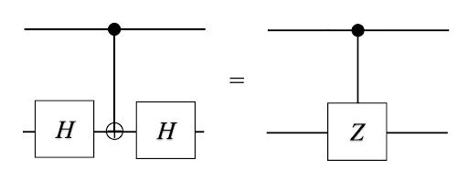
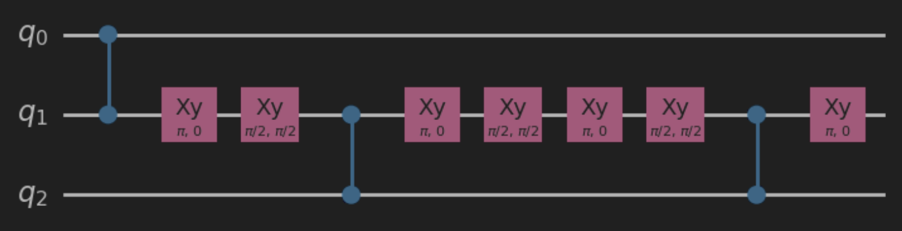
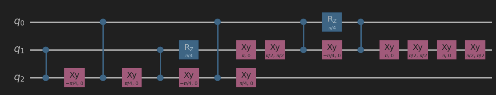
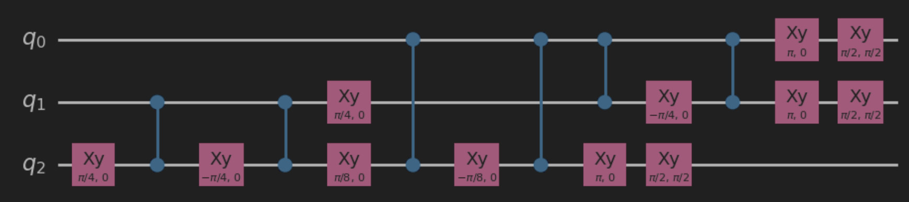
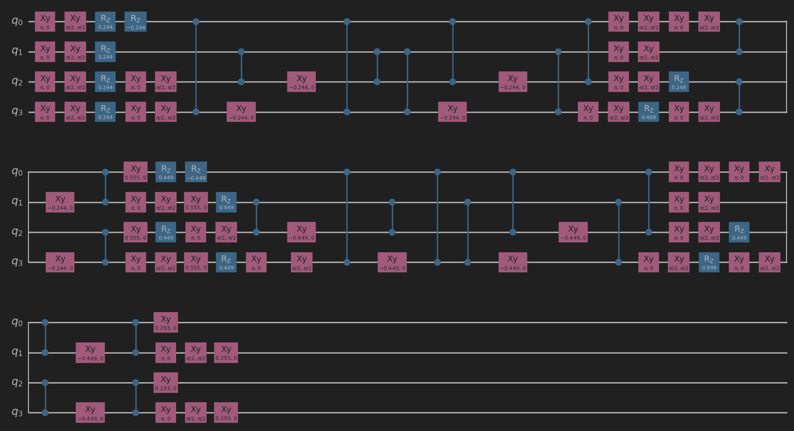
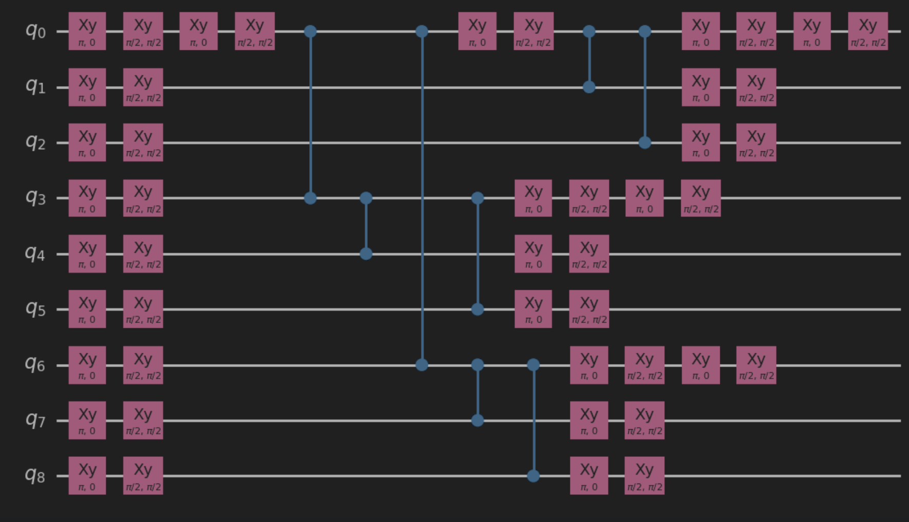
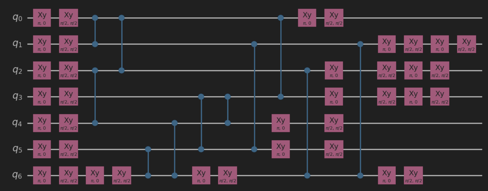

# Building a Neutral-Atom Quantum Compiler for Circuit Optimization

### iQuHack 2025 Submission<br>

## 1. Introduction

Quantum computing with neutral-atom processors presents new possibilities due to its reconfigurable connectivity, long coherence times, and native entangling gates. However, optimizing circuits for these systems is significantly more complex than for fixed-layout superconducting qubit architectures.
<br>
At the outset, we treated this problem as an opportunity to build a neutral-atom quantum compiler rather than manually optimizing individual circuits. The goal was to create a pipeline that takes any arbitrary quantum circuit and outputs an optimized implementation for neutral-atom hardware, minimizing gate count, execution time, and atom movement while respecting the architectural constraints.
<br>
However, as we progressed, we encountered several key realizations:

1. The optimization problem was NP-hard, meaning an exhaustive search was infeasible.
2. Circuit decomposition held valuable insights, and extracting constraints could reduce the search space.
3. A structured optimization plan—rather than direct brute-force searching—was necessary for handling movement and scheduling efficiently.
4. An algorithmic approach emerged as the most effective way to structure optimization, leading to a combination of greedy search and genetic algorithms.
5. Integration with Bloqade required a well-defined intermediate representation (IR).

<br>
This document outlines our process, key insights, algorithmic choices, and progress toward developing a neutral-atom quantum compiler.

## 2. Compilation Approach: From Idea to Implementation

Our work progressed in four major phases, each building on the lessons learned from the previous step.

### 2.1 Initial Concept: A Neutral-Atom Quantum Compiler

Our first idea was to create a general-purpose compiler for neutral-atom quantum computers. The goal was simple: Take any quantum circuit and produce an optimized version tailored for neutral-atom execution.<br>

At this stage, we assumed that:

- **Existing quantum compilers** (e.g., Qiskit, Cirq) were not well-adapted to neutral-atom constraints.
- **A fully automated approach** would yield better results than manual optimization.

However, as we attempted to define our compiler’s behavior, the efficiency bottleneck became evident. The problem was inherently NP-hard, meaning that a naïve brute-force search for the best circuit representation would not scale.
<br>
This led to the first major shift in approach: Rather than exhaustively searching for the best circuit, we needed to extract structure from the problem to guide the optimization.

### 2.2 Circuit Decomposition: Extracting Insights for Constraints

To tackle the search space complexity, some of our team members focused on analyzing circuit decomposition to gather insights that could constrain the optimization problem.
<br>
Key realizations from this phase:

- **Not all decompositions are hardware-efficient:**
  - Many common decompositions use CNOT-based constructions, which are inefficient for neutral-atom architectures.
  - Rewriting circuits using Controlled-Z (CZ) gates significantly reduced entangling gate count.
- **Parallelization opportunities:**
  - Global operations (e.g., global RzRz​) should be prioritized to reduce local control overhead.
  - Gate zones limit the number of simultaneous operations, so circuits must be structured accordingly.
- **Atom movement must be minimized:**

  - Moving qubits excessively between storage and gate zones introduces decoherence and loss.
  - Optimal gate scheduling should respect neutral-atom constraints before even searching for the best layout.

These insights led to the next refinement in our approach:
<br>
Instead of optimizing blindly, we structured the search space with predefined constraints, allowing an efficient algorithmic approach.

### 2.3 Optimization Strategy: From Greedy Search to Genetic Algorithms

Once we had extracted hardware-aware constraints, the next challenge was figuring out a better way to initialize gates and move atoms efficiently. This led us to explore algorithmic approaches.

#### 2.3.1 Early Approach: Greedy Search

Our first attempt was a greedy search algorithm, where we iteratively:

1. Selected the best next move based on minimizing swap count.
2. Prioritized parallel execution of non-conflicting gates.
3. Reduced circuit depth by identifying mutually commutable operations.

This method was fast but often got stuck in local minima—meaning it sometimes found a good solution, but not the bestone.

#### 2.3.2 Evolving the Approach: Genetic Algorithms

Recognizing the limitations of greedy search, we moved to a genetic algorithm approach, where:

1. Multiple circuit configurations (population) were generated.
2. Each candidate was evaluated using a heuristic-based cost function.
3. The best-performing candidates were selected and evolved over generations.

Heuristics Used for Evaluation
<br>
Each candidate was scored based on:

- NCZNCZ​: The number of entangling Controlled-Z operations (since these dominate error rates).
- NswapNswap​: The number of swap operations needed to rearrange atoms.
- TexecTexec​: The total execution time based on layered scheduling constraints.
- NlocalNlocal​: The number of local vs. global rotations (favoring global rotations to reduce control complexity).

Single Qubit Movement Heuristics
Optimizes where to place individual qubits when moving them into the gate zone.

| Heuristic               | Description                                                                |
| ----------------------- | -------------------------------------------------------------------------- |
| Default Movement        | Places qubits in the first available gate position.                        |
| Most Connected Movement | Chooses a position with the highest number of adjacent connections.        |
| Cost-Aware Movement     | Selects a position that minimizes movement cost and adjacency constraints. |
| Random Movement         | Randomly assigns a free gate position.                                     |

---

Two-Qubit Adjacency Heuristics
Selects optimal positions for qubit pairs used in CZ operations.

| Heuristic             | Description                                                                        |
| --------------------- | ---------------------------------------------------------------------------------- |
| Default Adjacency     | Places qubits in the first available adjacent slots.                               |
| Nearest Adjacency     | Finds the closest adjacent pair with minimal movement cost.                        |
| Least Interference    | Minimizes interference with other active qubits in the gate zone.                  |
| Centered Placement    | Places qubits towards the center of the gate zone for equalized movement distance. |
| Preemptive Adjacency  | Predicts future CZ operations and places qubits accordingly.                       |
| Load Balancing        | Distributes qubits evenly across the gate zone to prevent congestion.              |
| Future Entanglement   | Optimizes placement based on future multi-qubit interactions.                      |
| Minimal Swap Strategy | Ensures qubits move the least possible distance                                    |

By evolving candidate solutions, the genetic algorithm significantly improved circuit efficiency compared to both the greedy search and naive decomposition.Implemented Heuristics

### 2.4 Intermediate Representation & Bloqade Integration

Once the optimization phase produced an improved circuit, the final step was translating it into Bloqade-compatible code.
One of our team members explored Bloqade’s kernel functions to develop an Intermediate Representation (IR) that:

- Mapped optimized circuits into Bloqade’s gate syntax.
- Preserved parallel execution optimizations.
- Ensured compatibility with neutral-atom execution constraints.

This allowed us to test our compiled circuits directly in Bloqade simulations. The following section refers to the compile_to_bloqade.py file found in our submission. Designing this pipeline provides a robust infrastructure for future work in circuit optimization and compilation for neutral-atom systems. By establishing a modular and extensible approach, we enable further improvements in scheduling, routing, and qubit mapping strategies, fostering an adaptable and scalable compilation framework.

### 2.5 IR Design

Our IR is constructed as a dictionary with two key elements:

- position: A list of lists representing qubit positions at each step.
- operator: A list of tuples specifying operations, their parameters, and whether they are global or local.

Example IR structure:

```python
ir_code = {
    "position": [[0,1,2,3],[0,1,50,51],[0,1,50,51],[0,1,50,51],[0,1,50,2],[0,51,50,2]],
    "operator": [("move", [], True), ("move", [], True), ("rxy", [0,1], False, np.pi/2, np.pi/2),
                  ("cz", [], True), ("move", [], True), ("move", [], True)]
}
```

Each entry in position corresponds to a timestep, and each operation in operator aligns with the same index in position. If the operation is "move", the positions determine the source and destination qubits. If it is a gate operation, the affected qubits are explicitly listed.
This representation allows efficient encoding of the entire circuit execution at the hardware level while maintaining flexibility for modifications.

### 2.6 Bloqade Circuit Construction

To dynamically construct Bloqade circuits, we implemented an ir_to_bloqade function that interprets the IR and converts it into Bloqade-compatible commands. A key component is move_zone, which handles qubit movement using Bloqade’s move.core.AtomState:

```python
@move.vmove
def move_zone(state: move.core.AtomState, from_zone, to_zone, from_index, to_index):
    state.to_zone[to_index] = move.Move(state.from_zone[from_index])
    return state
```

Additionally, we designed a new function that initializes a qubit register and assigns positions:

```python
def new(num_qubits, positions):
    qubits = [i for i in range(num_qubits)]
    @move.vmove
    def kernel():
        q = move.NewQubitRegister(num_qubits)
        state = move.Init(qubits, positions)
        return state
    return kernel
```

This systematic approach ensures that optimized circuits can be translated into Bloqade efficiently while preserving all execution constraints.

### 2.7 Challenges and Future Directions

The technical implementation of IR conversion presented challenges, particularly in dynamically mapping arbitrary circuits to Bloqade’s execution model. While some issues remain unresolved, our current design establishes a clear framework for compiler pipeline development.
By designing our own IR, we gain flexibility to explore various scheduling, mapping, and routing strategies. This modular approach enables seamless integration with different optimization techniques, making the entire compilation pipeline more adaptable and scalable.

## 3. Circuit implementation

Decomposition of the given circuits into the native gate language of our neutral atom computer was a significant portion of the challenge this year. To ensure that we created accurate, efficient circuits, we followed three tenets for our circuit construction:

**1. Construction of complex gates using our native gate set**: For this challenge, we were permitted to use three distinct gates: a CZ gate, a rotation around the Z axis, and a rotation around an axis in the XY plane. However, we were challenged to implement gates which were not immediately included in this set. To do this, we constructed necessary gates out of our limited set.
For example, the CNOT gate can be constructed using a CZ gate surrounded by Hadamards on the target qubit. Hadamards, in turn, can be implemented as a 90º rotation around the Y-axis, followed by a 180º rotation around the X-axis. By leveraging our gate set in imaginative ways, we were able to construct many arbitrary gates
<br>


**2. The use of commutation identities to simplify the circuit**: Because we were forced to enact operations with a small collection of simple gates, our circuits were often left with many single-qubit gates that would have been very costly to implement. As such, we took advantage of commutation relations to simplify things. For example, a rotation of an arbitrary angle around the Z-axis, when surrounded by Hadamard gates, is equivalent to that same rotation around the X-axis. Similarly, if an operator is immediately followed by its conjugate transpose, the pair will cancel out and we can disregard them entirely.

**3. Emphasis on global gates**: In the cost function of our circuits, global gates have a much lower cost than a gate on an individual qubit. As such, whenever possible, we leveraged global gates to make our circuit more efficient. Even if we didn’t necessarily need to conduct an operation on all of our qubits—if, for example, we only needed to implement an x-rotation around three of our four qubits— we found that it was often still more efficient to enact a global rotation and then use single-qubit gates to “correct” the qubits which didn’t need that operation.

However, constructing an efficient circuit was not the only challenge. We also needed to implement our circuit in a way which reduced the time spent on the neutral-atom simulator. To do this, we focused on two approaches:

**1. Placing our “central nodes” near the center**: In many of our circuits, we found that many qubits would all become entangled through operations with some singular qubit (or sometimes multiple). We call that qubit the “central node” When placing our qubits in storage, we usually placed the central node near the center of our qubit distribution, so that no qubit would need to travel far to conduct an entanglement operation with it.

**2. Grouping moves**: Again, time is of the essence when implementing these operations. As such, while moving one atom at a time would be the much easier solution, doing so would be extremely costly for our runtime. As such, we structured our circuit implementations such that we could move many atoms concurrently without them overlapping. For example, if we knew that atom #4 would need to pass to the left over atom #3 to reach its new entangling partner, but atom #3 also needed to change positions, we would structure our circuit so that atom #3’s final destination was also to the left. In this way, we could move atoms #4 and #3 concurrently to reduce movement time.

## 4. Challenge Solutions

1. **Question 1.1**<br>
   time: 5.399560555969611<br>
   ntouches: 4<br>
   nmoves: 2<br>
   apply_cz: 2<br>
   apply_local_xy: 4<br>
   overall: 8.279912111193923
   
2. **Question 1.2**<br>
   time: 18.400656362432144<br>
   ntouches: 10<br>
   nmoves: 8<br>
   apply_cz: 6<br>
   apply_local_xy: 9<br>
   apply_local_rz: 2<br>
   overall: 23.180131272486427
   
3. **Question 2**<br>
   time: 7.42558007523081
   ntouches: 6<br>
   nmoves: 3<br>
   apply_local_xy: 6<br>
   apply_cz: 6<br>
   apply_global_xy: 6<br>
   overall: 15.405116015046163
   
4. **Question 3**
   N/A
   
5. **Question 4**<br>
   time: 26.51189099066703<br>
   ntouches: 14<br>
   nmoves: 8<br>
   apply_global_xy: 36<br>
   apply_local_xy: 10<br>
   apply_cz: 8<br>
   overall: 30.222378198133406
   
6. **Question 5**<br>
   time: 21.23919760197064<br>
   ntouches: 17<br>
   nmoves: 7<br>
   apply_global_xy: 28<br>
   apply_local_xy: 10<br>
   apply_cz: 11<br>
   overall: 34.40783952039413
   

## 5. Question 3

Unfortunately, we were unable to validate our solution for question 3. However, we were able to test our circuit when compared to a Qiskit circuit that we determined was identical to the challenge circuit. When we compiled our decomposed circuit in Qiskit and compared it to the target circuit when acting upon a random statevector, we found that they carried out the exact same operation. As such, our circuit for question 3 does successfully carry out the challenge operation.
